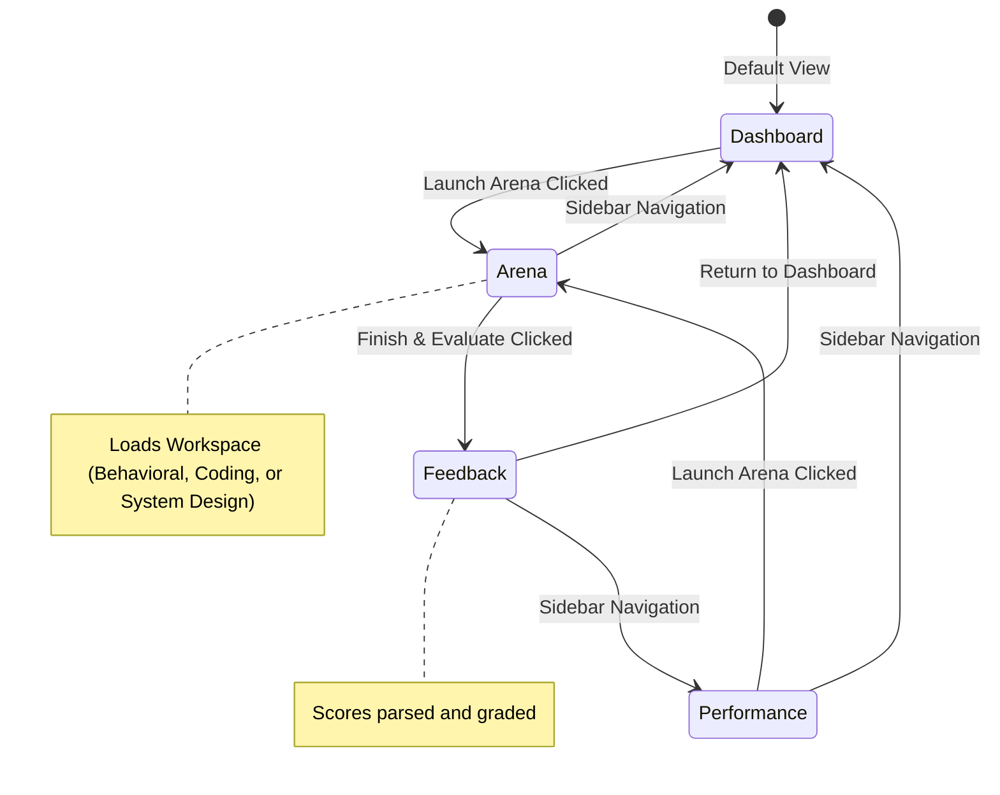

# ConvoGlass: Technical Documentation Manual

This document provides a deep-dive technical overview of ConvoGlass's internal mechanics, state models, and architectural flows.

---

## 1. State Machine & Routing

ConvoGlass manages client-side views using local React states. The routing is centralized in [workspace/page.tsx](file:///c:/Users/kumar/OneDrive/Documents/convo-glass/src/app/workspace/page.tsx).



### Active Views Summary
1.  **Dashboard**: Configures the round criteria (type of interview, interviewer persona, company profile) and handles resume parsing.
2.  **Arena**: The active interview workspace containing:
    *   **Behavioral Round**: Chat bubbles displaying conversation dialogue.
    *   **Coding Round**: Split view of problem description + Monaco Editor + execution log terminal.
    *   **System Design Round**: Split view of drawing vector whiteboard canvas + interviewer feed.
3.  **Feedback**: Compiles evaluation reports, circular progress grades, strength/weakness bullet points, and roadmaps.
4.  **Performance**: Chart.js displays historical score lines and pace/filler word scatter charts.

---

## 2. Speech Analytics Engine

The voice interaction resides in [speech.ts](file:///c:/Users/kumar/OneDrive/Documents/convo-glass/src/lib/speech.ts) and uses the browser's Web Speech API.

### Word-Per-Minute (WPM) & Pacing Calculations
During voice recording, intermediate timestamps are tracked:
$$\text{WPM} = \text{Math.round}\left(\frac{\text{Word Count}}{\text{Duration in Minutes}}\right)$$

### Filler Word Tracking
The speech engine scans transcripts against a pre-defined array:
```typescript
const FILLER_WORDS = ["um", "uh", "like", "basically", "actually", "so", "you know"];
```
It computes a **Filler Count** based on pattern matching:
```typescript
const words = transcript.toLowerCase().split(/\s+/);
const fillerCount = words.filter(w => FILLER_WORDS.includes(w)).length;
```

### Confidence Score Calculation
The confidence score is derived from:
1.  Browser Speech Recognition's native `confidence` index (representing transcription accuracy).
2.  Filler word density penalty.
3.  Speaking pace bounds (penalizing speech under 90 WPM or over 160 WPM).

---

## 3. Whiteboard Vector Rendering

[SystemDesignCanvas.tsx](file:///c:/Users/kumar/OneDrive/Documents/convo-glass/src/components/SystemDesignCanvas.tsx) renders elements manually inside an HTML5 `<canvas>` rendering context.

### Node Data Structure
```typescript
interface Node {
  id: number;
  type: "rect" | "circle" | "cloud" | "text";
  label: string;
  x: number;   // Top-left boundary
  y: number;   // Top-left boundary
  w: number;   // Width
  h: number;   // Height
}
```

### Vector Angle Calculations for Arrow Connectors
To draw clean connections between nodes without lines overlapping the shapes:
1.  Determine center points ($C_{\text{from}}$, $C_{\text{to}}$) of source and target shapes.
2.  Calculate angle of direction:
    $$\theta = \arctan2(y_{\text{to}} - y_{\text{from}}, x_{\text{to}} - x_{\text{from}})$$
3.  Apply boundary offsets to offset the start and end of the line:
    $$\text{startX} = C_{\text{from}.x} + \cos(\theta) \times (W_{\text{from}} / 2)$$
    $$\text{startY} = C_{\text{from}.y} + \sin(\theta) \times (H_{\text{from}} / 2)$$
    $$\text{endX} = C_{\text{to}.x} - \cos(\theta) \times (W_{\text{to}} / 2)$$
    $$\text{endY} = C_{\text{to}.y} - \sin(\theta) \times (H_{\text{to}} / 2)$$

---

## 4. Local Coding Compiler Sandbox

JavaScript code is compiled on the client. [CodeWorkspace.tsx](file:///c:/Users/kumar/OneDrive/Documents/convo-glass/src/components/CodeWorkspace.tsx) runs the code against LeetCode test cases:

```typescript
// Intercepting console logs
const capturedLogs: string[] = [];
const originalLog = console.log;
console.log = (...args: any[]) => {
  capturedLogs.push(args.map(String).join(" "));
};

// Evaluate target JS code
try {
  const executor = new Function(evalString);
  const result = executor();
  // Assertion comparisons...
} catch (err) {
  // Capture execution/syntax errors
} finally {
  console.log = originalLog; // Restore standard console
}
```

---

## 5. Mock Interview Scenarios & Personas

Core interviewer databases are defined in [data.ts](file:///c:/Users/kumar/OneDrive/Documents/convo-glass/src/lib/data.ts):

| Persona | Role / Profile | Tone / Personality |
| :--- | :--- | :--- |
| **Friendly Fred** | Behavioral/HR Recruiter | Encouraging, soft questions, conversational |
| **Strict Sarah** | System Design Lead | Direct, tests boundary limits, questions trade-offs |
| **FAANG Frank** | Algorithmic Interviewer | High-pressure, strict time limits, silent, evaluates performance |

---

## 6. How to Extend the Platform

### Add a New Interviewer Persona
1.  Open [data.ts](file:///c:/Users/kumar/OneDrive/Documents/convo-glass/src/lib/data.ts).
2.  Locate `INTERVIEW_PERSONAS`.
3.  Append a new record satisfying the `InterviewerPersona` type definition:
    ```typescript
    {
      id: "persona-id",
      name: "Interviewer Name",
      role: "Title",
      emoji: "🧑‍💻",
      intro: "Introductory greeting speech script...",
      responses: {
        default: "Fallback speech...",
        agreement: "Positive validation...",
        um: "Response to filler words..."
      },
      sampleQuestions: [
        "First question...",
        "Second question..."
      ]
    }
    ```

### Add a Coding Question
1.  Open [data.ts](file:///c:/Users/kumar/OneDrive/Documents/convo-glass/src/lib/data.ts).
2.  Locate `CODING_QUESTIONS`.
3.  Append a new record satisfying the `CodingQuestion` type:
    ```typescript
    {
      id: "question-id",
      title: "Problem Name",
      difficulty: "Easy" | "Medium" | "Hard",
      description: "Markdown instructions...",
      languages: {
        javascript: { starter: "Starter JS template..." },
        python: { starter: "Starter Python template..." }
      },
      testCases: [
        { input: "[arguments]", expected: "expectedOutcome" }
      ]
    }
    ```
